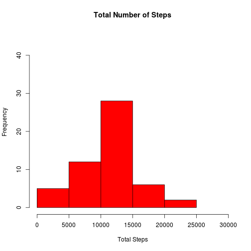
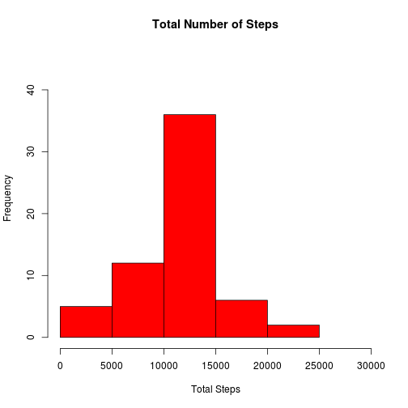
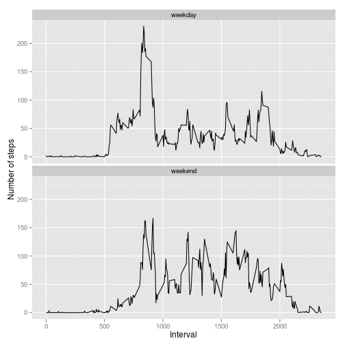

# Reproducible Research: Peer Assessment 1

## Loading and preprocessing the data

### Loading the data. Set the working directory to the directory where the file resides.

```r
    ### read the file into a data frame
    actMon_DF <- read.csv("./activity.csv",
                           header = T,
                           sep=',',
                           colClasses = c("numeric", "Date", "numeric"),
                           stringsAsFactors = FALSE)
    summary(actMon_DF)
```

```
##      steps            date               interval   
##  Min.   :  0.0   Min.   :2012-10-01   Min.   :   0  
##  1st Qu.:  0.0   1st Qu.:2012-10-16   1st Qu.: 589  
##  Median :  0.0   Median :2012-10-31   Median :1178  
##  Mean   : 37.4   Mean   :2012-10-31   Mean   :1178  
##  3rd Qu.: 12.0   3rd Qu.:2012-11-15   3rd Qu.:1766  
##  Max.   :806.0   Max.   :2012-11-30   Max.   :2355  
##  NA's   :2304
```

### Preprocess the data by removing rows containing NAs

```r
    ### remove the NA values
    library(data.table)
    actMon_DT <- as.data.table(actMon_DF[complete.cases(actMon_DF),])
    str(actMon_DT)
```

```
## Classes 'data.table' and 'data.frame':	15264 obs. of  3 variables:
##  $ steps   : num  0 0 0 0 0 0 0 0 0 0 ...
##  $ date    : Date, format: "2012-10-02" "2012-10-02" ...
##  $ interval: num  0 5 10 15 20 25 30 35 40 45 ...
##  - attr(*, ".internal.selfref")=<externalptr>
```

## What is mean total number of steps taken per day?

##### Common function to draw a histogram and output mean and median

```r
hist_mean_median <- function(df1) {
        ### compute the total steps per day into a data frame
        hist(df1$stepsperday, 
                    xlim=c(0, 30000), ylim=c(0,45),
                    xlab = "Total Steps", ylab = "Frequency",
                    main = "Total Number of Steps",
                  col = "RED"
            )
        summary(df1)

        ### compute mean of total number of steps per day
        #print(mean.actMonSum.mean <- mean(actMonSum_DF$stepsperday))

        ### compute median of total number of steps per day
        #print(median.actMonSum <- median(actMonSum_DF$stepsperday))
        cat(sprintf("Mean = %f, Median = %f\n", 
                          mean(actMonSum_DF$stepsperday),
                          median(actMonSum_DF$stepsperday)
                    )
            )
}
```

### Make a histogram and output mean, median of the total number of steps taken each day

```r
    ### compute the total steps per day into a data frame
    actMonSum_DF <-aggregate(actMon_DT$steps, list(date=actMon_DT$date), sum)  
    colnames(actMonSum_DF) <- c("date", "stepsperday")
    hist_mean_median(actMonSum_DF)
```

 

```
## Mean = 10766.188679, Median = 10765.000000
```

## What is the average daily activity pattern?

### Make a plot of the 5-min interval(x-axis) and the average number of steps taken, averaged across all days(y-axis)

```r
    ### compute the average number steps per interval across all days
    actMonIntMedian_DF <-aggregate(actMon_DT$steps, list(interval=actMon_DT$interval), mean)  
    colnames(actMonIntMedian_DF) <- c("interval", "stepsperint.median")
    ### plot the 5-min and avg num of steps per interval across all days
    plot(actMonIntMedian_DF$interval, actMonIntMedian_DF$stepsperint.median,
            type="l",
            xlab = "5-min interval",
            ylab = "Avg. number of steps",
            main = "Avg. number of Steps per 5-min interval" 
         )
```

 

### Interval containing the maximum average number of steps across all days

```r
    print(actMonIntMedian_DF[which(actMonIntMedian_DF$stepsperint.median == 
                                     max(actMonIntMedian_DF$stepsperint.median)),])
```

```
##     interval stepsperint.median
## 104      835              206.2
```

## Imputing missing values

### Calculate the total number of rows with NAs

```r
    print(paste0("Total Number of rows with NA in date: ", 
                 nrow(actMon_DF[(is.na(actMon_DF$date)),])))
```

```
## [1] "Total Number of rows with NA in date: 0"
```

```r
    print(paste0("Total Number of rows with NA in interval: ", 
                 nrow(actMon_DF[(is.na(actMon_DF$interval)),])))
```

```
## [1] "Total Number of rows with NA in interval: 0"
```

```r
    row.has.na <- apply(actMon_DF, 1, function(x){any(is.na(x))})
    print(paste0("Total number of rows with NAs(steps=NA): ", sum(row.has.na)))
```

```
## [1] "Total number of rows with NAs(steps=NA): 2304"
```
### Fill in the missing values in the dataset
##### The missing values will be replaced by the corresponding mean value of the 5-min interval that was calculated above.

```r
    ### separate the good rows from NA rows into different data frames
    goodVals_DF <- actMon_DF[!(row.has.na),]
    missingVals_DF <- actMon_DF[row.has.na,]

    ### merge the missing value data frame with the data frame containing 
    ### mean values of the 5-min interval over the interval column.
    merged1_DF <- merge(missingVals_DF, actMonIntMedian_DF, 
                         by.X = "interval", by.Y = "interval", 
                         all = TRUE)
    
    ### impute the rounded value of the mean into the steps column thus 
    ### overwriting the NA values
    merged1_DF$steps <- round(merged1_DF$stepsperint.median,0)
    merged1_DF$stepsperint.median <- NULL

    ### combine the merged data frame with the data frame containing non-NA rows.
    ### to get the new data frame with no NAs.
    imputed_DF <- rbind(goodVals_DF, merged1_DF)
```
### New data set with the missing data filled in

```r
    summary(imputed_DF)
```

```
##      steps            date               interval   
##  Min.   :  0.0   Min.   :2012-10-01   Min.   :   0  
##  1st Qu.:  0.0   1st Qu.:2012-10-16   1st Qu.: 589  
##  Median :  0.0   Median :2012-10-31   Median :1178  
##  Mean   : 37.4   Mean   :2012-10-31   Mean   :1178  
##  3rd Qu.: 27.0   3rd Qu.:2012-11-15   3rd Qu.:1766  
##  Max.   :806.0   Max.   :2012-11-30   Max.   :2355
```
### Make a histogram, and compute the mean, median of the total steps per day with the missing data filled in.

```r
    actMon_DT <- as.data.table(imputed_DF[complete.cases(imputed_DF),])
    actMonSum_DF <-aggregate(actMon_DT$steps, list(date=actMon_DT$date), sum)  
    colnames(actMonSum_DF) <- c("date", "stepsperday")

    hist_mean_median(actMonSum_DF)
```

 

```
## Mean = 10765.639344, Median = 10762.000000
```
##### As per the histograms, the frequencies of steps around the mean have gone up. This is expected because the values filled in were the mean values of the 5-min intervals. The actual mean and median values have shown very small change. Overall, the impact of filling in the missing values is insignificant.


## Are there differences in activity patterns between weekdays and weekends?
### Create a new factor variable with two levels - "weekday" and "weekend"

```r
    ### add a weekday string(Monday,....,Sunday) and a factor variable ("weekend", or "weekday")
    imputed_DF$daystr <- weekdays(imputed_DF$date)
    imputed_DF <- transform(imputed_DF, 
                        daytype=ifelse(wday(as.POSIXlt(date, format='%Y-%m-%d')) %in% c(1,7), 
                                            "weekend", "weekday"))
    str(imputed_DF)
```

```
## 'data.frame':	17568 obs. of  5 variables:
##  $ steps   : num  0 0 0 0 0 0 0 0 0 0 ...
##  $ date    : Date, format: "2012-10-02" "2012-10-02" ...
##  $ interval: num  0 5 10 15 20 25 30 35 40 45 ...
##  $ daystr  : chr  "Tuesday" "Tuesday" "Tuesday" "Tuesday" ...
##  $ daytype : Factor w/ 2 levels "weekday","weekend": 1 1 1 1 1 1 1 1 1 1 ...
```

### Make a panel plot of the 5-min interval (x-axis) and the average number of steps taken averaged across all weekday days or weekend days (y-axis)

```r
    ### calculate the average number of steps for each interval and weekday/weekend
    imputed_DT <- as.data.table(imputed_DF)
    plot_DF <- imputed_DT[, mean(steps), by=c("interval","daytype")]
    colnames(plot_DF) <- c("interval", "daytype", "avgstepsperint")
```

```
## Warning: The colnames(x)<-value syntax copies the whole table. This is due
## to <- in R itself. Please change to setnames(x,old,new) which does not
## copy and is faster. See help('setnames'). You can safely ignore this
## warning if it is inconvenient to change right now. Setting options(warn=2)
## turns this warning into an error, so you can then use traceback() to find
## and change your colnames<- calls.
```

```r
    library(ggplot2)
    sp <- ggplot(plot_DF, aes(x=interval, y=avgstepsperint)) + geom_line(shape=1)
    sp + facet_wrap(~ daytype, ncol=1) +
         labs(x="Interval", y="Number of steps")
```

 

